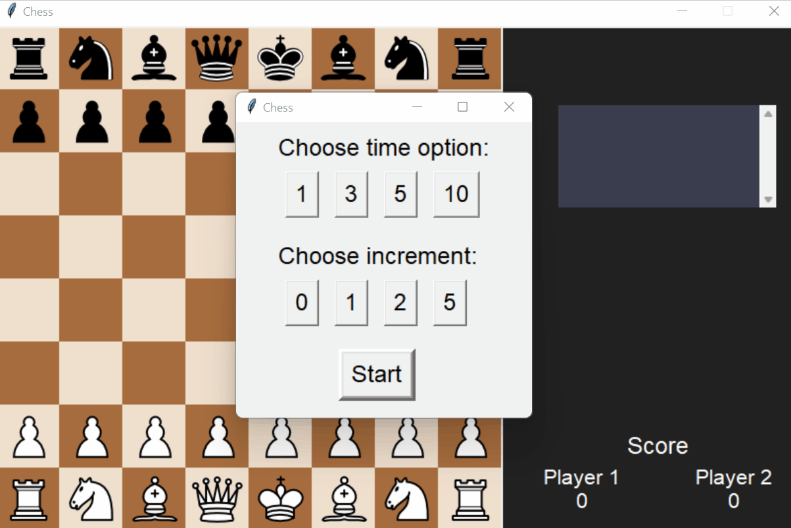

# Chess

This project was created for the Python class at AGH University of Science and Technology. It is a hot-seat style chess app.

All of the rules of chess were correctly implemented including some of the lesser known amongst the beginners:
* En passant
* Promotion of pieces
* Inability to move pinned pieces if it puts the player's king in check
* Ability to save the king from a check by another piece (unless the king is being checked by 2 enemy pieces)
* Castling and the inability to castle while in check or if one of the squares of the castling route is in check

The game begins by choosing the time format and the time increment after each move. If either player runs out of time before making a move he/she loses automatically. After each move the engine checks for checkmates, stalemates and checks. When the game is over the scores are updated and the players are given a chance of reviewing the game they have just finished or playing a new one (this time with opposing colors). All of the moves played are kept in the upper-right corner of the screen.


<p align='center'>
   
</p>

To run the app type in the project's directory:
```
python .\engine.py
```


# Technology

* Python
* Tkinter for visualisation
